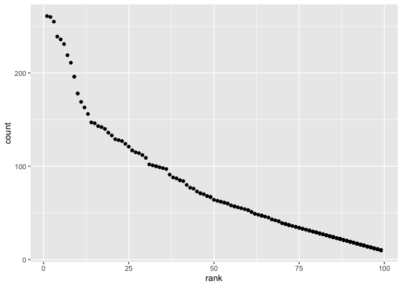

p8105_hw2_zy2378.Rmd
================
zy
10/7/2021

``` r
library(tidyverse)
```

    ## ── Attaching packages ─────────────────────────────────────── tidyverse 1.3.1 ──

    ## ✓ ggplot2 3.3.3     ✓ purrr   0.3.4
    ## ✓ tibble  3.1.1     ✓ dplyr   1.0.7
    ## ✓ tidyr   1.1.3     ✓ stringr 1.4.0
    ## ✓ readr   2.0.1     ✓ forcats 0.5.1

    ## ── Conflicts ────────────────────────────────────────── tidyverse_conflicts() ──
    ## x dplyr::filter() masks stats::filter()
    ## x dplyr::lag()    masks stats::lag()

``` r
library(readxl)
library(stringr)
library(dplyr)
library(ggplot2)
library(lubridate)
```

    ## 
    ## Attaching package: 'lubridate'

    ## The following objects are masked from 'package:base':
    ## 
    ##     date, intersect, setdiff, union

``` r
trashwheel_df=
  readxl::read_excel("./data/Trash-Wheel-Collection-Totals-7-2020-2.xlsx",sheet=1,range="A2:N535")%>%
  janitor::clean_names()%>%
  drop_na()%>%
  mutate(sports_balls=round(sports_balls))
trashwheel_df
```

    ## # A tibble: 453 x 14
    ##    dumpster month  year date                weight_tons volume_cubic_yards
    ##    <chr>    <chr> <dbl> <dttm>                    <dbl>              <dbl>
    ##  1 1        May    2014 2014-05-16 00:00:00        4.31                 18
    ##  2 2        May    2014 2014-05-16 00:00:00        2.74                 13
    ##  3 3        May    2014 2014-05-16 00:00:00        3.45                 15
    ##  4 4        May    2014 2014-05-17 00:00:00        3.1                  15
    ##  5 5        May    2014 2014-05-17 00:00:00        4.06                 18
    ##  6 6        May    2014 2014-05-20 00:00:00        2.71                 13
    ##  7 7        May    2014 2014-05-21 00:00:00        1.91                  8
    ##  8 8        May    2014 2014-05-28 00:00:00        3.7                  16
    ##  9 9        June   2014 2014-06-05 00:00:00        2.52                 14
    ## 10 10       June   2014 2014-06-11 00:00:00        3.76                 18
    ## # … with 443 more rows, and 8 more variables: plastic_bottles <dbl>,
    ## #   polystyrene <dbl>, cigarette_butts <dbl>, glass_bottles <dbl>,
    ## #   grocery_bags <dbl>, chip_bags <dbl>, sports_balls <dbl>,
    ## #   homes_powered <dbl>

``` r
precipitation_2019=
  readxl::read_excel("./data/Trash-Wheel-Collection-Totals-7-2020-2.xlsx",sheet=6,range="A2:B14")%>%
  drop_na()%>%
  mutate(year=2019)
precipitation_2019
```

    ## # A tibble: 12 x 3
    ##    Month Total  year
    ##    <dbl> <dbl> <dbl>
    ##  1     1  3.1   2019
    ##  2     2  3.64  2019
    ##  3     3  4.47  2019
    ##  4     4  1.46  2019
    ##  5     5  3.58  2019
    ##  6     6  0.42  2019
    ##  7     7  3.85  2019
    ##  8     8  2.39  2019
    ##  9     9  0.16  2019
    ## 10    10  5.45  2019
    ## 11    11  1.86  2019
    ## 12    12  3.57  2019

``` r
precipitation_2018=
  readxl::read_excel("./data/Trash-Wheel-Collection-Totals-7-2020-2.xlsx",sheet=7,range="A2:B14")%>%
  drop_na()%>%
  mutate(year=2018)
precipitation_2018
```

    ## # A tibble: 12 x 3
    ##    Month Total  year
    ##    <dbl> <dbl> <dbl>
    ##  1     1  0.94  2018
    ##  2     2  4.8   2018
    ##  3     3  2.69  2018
    ##  4     4  4.69  2018
    ##  5     5  9.27  2018
    ##  6     6  4.77  2018
    ##  7     7 10.2   2018
    ##  8     8  6.45  2018
    ##  9     9 10.5   2018
    ## 10    10  2.12  2018
    ## 11    11  7.82  2018
    ## 12    12  6.11  2018

``` r
precipitation_data = 
  bind_rows(precipitation_2018, precipitation_2019)%>%
  mutate(Month=rep(month.name,2))%>%
  relocate(year)

precipitation_data
```

    ## # A tibble: 24 x 3
    ##     year Month     Total
    ##    <dbl> <chr>     <dbl>
    ##  1  2018 January    0.94
    ##  2  2018 February   4.8 
    ##  3  2018 March      2.69
    ##  4  2018 April      4.69
    ##  5  2018 May        9.27
    ##  6  2018 June       4.77
    ##  7  2018 July      10.2 
    ##  8  2018 August     6.45
    ##  9  2018 September 10.5 
    ## 10  2018 October    2.12
    ## # … with 14 more rows

#For trashwheel data, number of obs is 453, and key variables include
weight_tons,volume_cubic_yards, etc.For precipitation data in 2018 and
2019，number of obs is 24, key variables include Total, etc.The total
precipitation in 2018 is 70.33, and the median number of sports balls in
a dumpster in 2019 is 9

``` r
pols_month=
  readr::read_csv("./data/fivethirtyeight_datasets/pols-month.csv")%>%
  separate(mon,into=c("year","month","day"))%>%
  mutate(month=c(rep(month.name,68),"January","February","March","April","May","June"))%>%
  pivot_longer(c(prez_gop,prez_dem),names_to="president",names_prefix = "prez_")%>%
  filter(value>=1)%>%
  mutate(year=as.numeric(year))%>%
  select(-day,-value)
```

    ## Rows: 822 Columns: 9

    ## ── Column specification ────────────────────────────────────────────────────────
    ## Delimiter: ","
    ## dbl  (8): prez_gop, gov_gop, sen_gop, rep_gop, prez_dem, gov_dem, sen_dem, r...
    ## date (1): mon

    ## 
    ## ℹ Use `spec()` to retrieve the full column specification for this data.
    ## ℹ Specify the column types or set `show_col_types = FALSE` to quiet this message.

``` r
pols_month
```

    ## # A tibble: 822 x 9
    ##     year month     gov_gop sen_gop rep_gop gov_dem sen_dem rep_dem president
    ##    <dbl> <chr>       <dbl>   <dbl>   <dbl>   <dbl>   <dbl>   <dbl> <chr>    
    ##  1  1947 January        23      51     253      23      45     198 dem      
    ##  2  1947 February       23      51     253      23      45     198 dem      
    ##  3  1947 March          23      51     253      23      45     198 dem      
    ##  4  1947 April          23      51     253      23      45     198 dem      
    ##  5  1947 May            23      51     253      23      45     198 dem      
    ##  6  1947 June           23      51     253      23      45     198 dem      
    ##  7  1947 July           23      51     253      23      45     198 dem      
    ##  8  1947 August         23      51     253      23      45     198 dem      
    ##  9  1947 September      23      51     253      23      45     198 dem      
    ## 10  1947 October        23      51     253      23      45     198 dem      
    ## # … with 812 more rows

``` r
snp_df=
  readr::read_csv("./data/fivethirtyeight_datasets/snp.csv")%>%
  mutate(date=mdy(date))%>%
  separate(date,into=c("year","month","day"),convert = TRUE)%>%
  mutate(year=ifelse(2049<year,year-100,year))%>%
  arrange(year,month)%>%
  mutate(month=c(rep(month.name,65),"January","February","March","April","May","June","July"))%>%
  mutate(year=as.numeric(year))%>%
  select(-day)
```

    ## Rows: 787 Columns: 2

    ## ── Column specification ────────────────────────────────────────────────────────
    ## Delimiter: ","
    ## chr (1): date
    ## dbl (1): close

    ## 
    ## ℹ Use `spec()` to retrieve the full column specification for this data.
    ## ℹ Specify the column types or set `show_col_types = FALSE` to quiet this message.

``` r
snp_df
```

    ## # A tibble: 787 x 3
    ##     year month     close
    ##    <dbl> <chr>     <dbl>
    ##  1  1950 January    17.0
    ##  2  1950 February   17.2
    ##  3  1950 March      17.3
    ##  4  1950 April      18.0
    ##  5  1950 May        18.8
    ##  6  1950 June       17.7
    ##  7  1950 July       17.8
    ##  8  1950 August     18.4
    ##  9  1950 September  19.5
    ## 10  1950 October    19.5
    ## # … with 777 more rows

``` r
unemployment_df=
  read_csv("./data/fivethirtyeight_datasets/unemployment.csv")%>%
  pivot_longer(Jan:Dec,names_to="month",values_to="unemployment")%>%
  drop_na()%>%
  mutate(month=c(rep(month.name,67),"January","February","March","April","May","June"))%>%
  rename(year=Year)
```

    ## Rows: 68 Columns: 13

    ## ── Column specification ────────────────────────────────────────────────────────
    ## Delimiter: ","
    ## dbl (13): Year, Jan, Feb, Mar, Apr, May, Jun, Jul, Aug, Sep, Oct, Nov, Dec

    ## 
    ## ℹ Use `spec()` to retrieve the full column specification for this data.
    ## ℹ Specify the column types or set `show_col_types = FALSE` to quiet this message.

``` r
unemployment_df
```

    ## # A tibble: 810 x 3
    ##     year month     unemployment
    ##    <dbl> <chr>            <dbl>
    ##  1  1948 January            3.4
    ##  2  1948 February           3.8
    ##  3  1948 March              4  
    ##  4  1948 April              3.9
    ##  5  1948 May                3.5
    ##  6  1948 June               3.6
    ##  7  1948 July               3.6
    ##  8  1948 August             3.9
    ##  9  1948 September          3.8
    ## 10  1948 October            3.7
    ## # … with 800 more rows

``` r
fivethirtyeight1_df=inner_join(pols_month,snp_df)
```

    ## Joining, by = c("year", "month")

``` r
fivethirtyeight_df=inner_join(fivethirtyeight1_df,unemployment_df)
```

    ## Joining, by = c("year", "month")

``` r
fivethirtyeight_df
```

    ## # A tibble: 786 x 11
    ##     year month   gov_gop sen_gop rep_gop gov_dem sen_dem rep_dem president close
    ##    <dbl> <chr>     <dbl>   <dbl>   <dbl>   <dbl>   <dbl>   <dbl> <chr>     <dbl>
    ##  1  1950 January      18      44     177      29      57     269 dem        17.0
    ##  2  1950 Februa…      18      44     177      29      57     269 dem        17.2
    ##  3  1950 March        18      44     177      29      57     269 dem        17.3
    ##  4  1950 April        18      44     177      29      57     269 dem        18.0
    ##  5  1950 May          18      44     177      29      57     269 dem        18.8
    ##  6  1950 June         18      44     177      29      57     269 dem        17.7
    ##  7  1950 July         18      44     177      29      57     269 dem        17.8
    ##  8  1950 August       18      44     177      29      57     269 dem        18.4
    ##  9  1950 Septem…      18      44     177      29      57     269 dem        19.5
    ## 10  1950 October      18      44     177      29      57     269 dem        19.5
    ## # … with 776 more rows, and 1 more variable: unemployment <dbl>

#For the pols_month dataset, it contains pols data each month for
democracy and republician from 1947 to 2015.For the snp dataset, it
contains snp data each month from 1950 to 2015.For the unemployment
dataset, it contains unemployment rate data each month from 1948 to
2015.For the resulting dataset,it has 786 rows and 11 columns, ranging
from 1950 to 2016, and key variables include gov_gop, close,
unemployment, etc.

``` r
popular_baby_names_df=
  readr::read_csv("./data/Popular_Baby_Names.csv")%>%
  janitor::clean_names()
```

    ## Rows: 19418 Columns: 6

    ## ── Column specification ────────────────────────────────────────────────────────
    ## Delimiter: ","
    ## chr (3): Gender, Ethnicity, Child's First Name
    ## dbl (3): Year of Birth, Count, Rank

    ## 
    ## ℹ Use `spec()` to retrieve the full column specification for this data.
    ## ℹ Specify the column types or set `show_col_types = FALSE` to quiet this message.

``` r
popular_baby_names_df = popular_baby_names_df %>%
  mutate(childs_first_name = tolower(childs_first_name))%>%
  mutate(ethnicity=gsub("ASIAN AND PACI|ASIAN AND PACIFIC ISLANDER","ASIAN AND PACIFIC ISLANDER",popular_baby_names_df$ethnicity))

popular_baby_names_df= popular_baby_names_df %>%
  mutate(ethnicity=gsub("BLACK NON HISP|BLACK NON HISPANIC","BLACK NON HISPANIC",popular_baby_names_df$ethnicity))

popular_baby_names_df= popular_baby_names_df %>%
  mutate(ethnicity=gsub("WHITE NON HISP|WHITE NON HISPANIC","WHITE NON HISPANIC",popular_baby_names_df$ethnicity))

popular_baby_names_df=popular_baby_names_df %>% distinct(year_of_birth,gender,ethnicity,childs_first_name, .keep_all = TRUE)

popular_baby_names_df
```

    ## # A tibble: 12,180 x 6
    ##    year_of_birth gender ethnicity                  childs_first_name count  rank
    ##            <dbl> <chr>  <chr>                      <chr>             <dbl> <dbl>
    ##  1          2016 FEMALE ASIAN AND PACIFIC ISLANDER olivia              172     1
    ##  2          2016 FEMALE ASIAN AND PACIFIC ISLANDER chloe               112     2
    ##  3          2016 FEMALE ASIAN AND PACIFIC ISLANDER sophia              104     3
    ##  4          2016 FEMALE ASIAN AND PACIFIC ISLANDER emily                99     4
    ##  5          2016 FEMALE ASIAN AND PACIFIC ISLANDER emma                 99     4
    ##  6          2016 FEMALE ASIAN AND PACIFIC ISLANDER mia                  79     5
    ##  7          2016 FEMALE ASIAN AND PACIFIC ISLANDER charlotte            59     6
    ##  8          2016 FEMALE ASIAN AND PACIFIC ISLANDER sarah                57     7
    ##  9          2016 FEMALE ASIAN AND PACIFIC ISLANDER isabella             56     8
    ## 10          2016 FEMALE ASIAN AND PACIFIC ISLANDER hannah               56     8
    ## # … with 12,170 more rows

``` r
olivia_df=
  filter(popular_baby_names_df,childs_first_name=="olivia",gender=="FEMALE")%>%
  select(-gender,-childs_first_name,-count)
olivia_df
```

    ## # A tibble: 24 x 3
    ##    year_of_birth ethnicity                   rank
    ##            <dbl> <chr>                      <dbl>
    ##  1          2016 ASIAN AND PACIFIC ISLANDER     1
    ##  2          2016 BLACK NON HISPANIC             8
    ##  3          2016 HISPANIC                      13
    ##  4          2016 WHITE NON HISPANIC             1
    ##  5          2015 ASIAN AND PACIFIC ISLANDER     1
    ##  6          2015 BLACK NON HISPANIC             4
    ##  7          2015 HISPANIC                      16
    ##  8          2015 WHITE NON HISPANIC             1
    ##  9          2014 ASIAN AND PACIFIC ISLANDER     1
    ## 10          2014 BLACK NON HISPANIC             8
    ## # … with 14 more rows

``` r
most_popular_name_df=
  filter(popular_baby_names_df,rank==1,gender=="MALE")%>%
  select(-gender,-rank,-count)
most_popular_name_df
```

    ## # A tibble: 24 x 3
    ##    year_of_birth ethnicity                  childs_first_name
    ##            <dbl> <chr>                      <chr>            
    ##  1          2016 ASIAN AND PACIFIC ISLANDER ethan            
    ##  2          2016 BLACK NON HISPANIC         noah             
    ##  3          2016 HISPANIC                   liam             
    ##  4          2016 WHITE NON HISPANIC         joseph           
    ##  5          2015 ASIAN AND PACIFIC ISLANDER jayden           
    ##  6          2015 BLACK NON HISPANIC         noah             
    ##  7          2015 HISPANIC                   liam             
    ##  8          2015 WHITE NON HISPANIC         david            
    ##  9          2014 ASIAN AND PACIFIC ISLANDER jayden           
    ## 10          2014 BLACK NON HISPANIC         ethan            
    ## # … with 14 more rows

``` r
male_whitenonhis_df=
  filter(popular_baby_names_df,gender=="MALE",year_of_birth==2016,ethnicity=="WHITE NON HISPANIC")
ggplot(male_whitenonhis_df, aes(x = rank, y = count))+
  geom_point()
```

<!-- -->

``` r
male_whitenonhis_df
```

    ## # A tibble: 364 x 6
    ##    year_of_birth gender ethnicity          childs_first_name count  rank
    ##            <dbl> <chr>  <chr>              <chr>             <dbl> <dbl>
    ##  1          2016 MALE   WHITE NON HISPANIC joseph              261     1
    ##  2          2016 MALE   WHITE NON HISPANIC michael             260     2
    ##  3          2016 MALE   WHITE NON HISPANIC david               255     3
    ##  4          2016 MALE   WHITE NON HISPANIC moshe               239     4
    ##  5          2016 MALE   WHITE NON HISPANIC jacob               236     5
    ##  6          2016 MALE   WHITE NON HISPANIC james               231     6
    ##  7          2016 MALE   WHITE NON HISPANIC benjamin            219     7
    ##  8          2016 MALE   WHITE NON HISPANIC alexander           211     8
    ##  9          2016 MALE   WHITE NON HISPANIC daniel              196     9
    ## 10          2016 MALE   WHITE NON HISPANIC henry               196     9
    ## # … with 354 more rows
